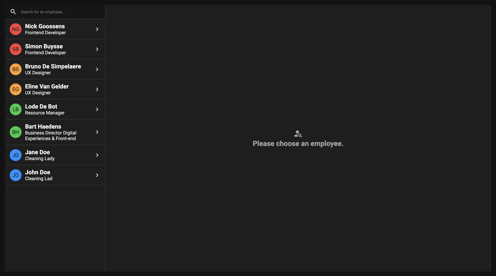
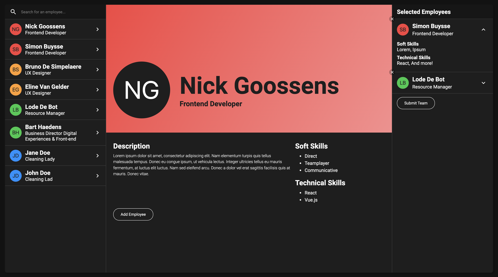

# Bold - React Assessment

This exercise exists to test your **HTML**, **CSS**, **JavaScript** and **React** knowledge.
You will receive (a specific amount of time) to do this exercise. Don't worry if you're unable to finish the entire thing, that way we can see what elements you prioritize. You will however be asked to explain how you would finish this exercise and why you would execute it that way.

When you're done with the exercise, please push it to [Github](https://github.com/), [Bitbucket](https://bitbucket.org/), [Gitlab](https://gitlab.com/) or a platform of your own choice and share it publicly so we can evaluate it.

- [Introduction](#introduction)
- [Requirements](#requirements)

## Introduction

The goal of this application is to:

- Manage a list of employees
- View details of an employee
- Add them to a team
- Upload that team through an API call

Styling-wise we would like you to approach the layout of the examples below.
It does not have to be pixel perfect or use the exact same colours but it's important for us to see you can remake the broad elements of a design.

## Requirements

### Must Haves

- A filterable list of employees
- A section that contains the details of a selected employee
- A list of selected employees
- A way to delete selected employees from that list
- Use SASS, CSS modules or styled-components to build your UI. (You can also use another option you prefer, if you can justify your choice.)

### Should Haves

- A GET API request that fetches employee data
- A POST API request that uploads the selected team
- A message to the user when no one has been selected
- A message to the user when there's no results found while filtering
- Hide the "selected employees" list when there's no items available
- Limited the "selected employees" list to a maximum of 5 people
- Disable the user from adding someone to the list twice

### Could Haves

- Create the project in TypeScript
- Implement a theme for employees based on their role (eg: red for developer, orange for design, etc.)
- Turn the selected employee list items into accordion elements that can close and open when clicked
- Add hover and click animations to interactable elements
